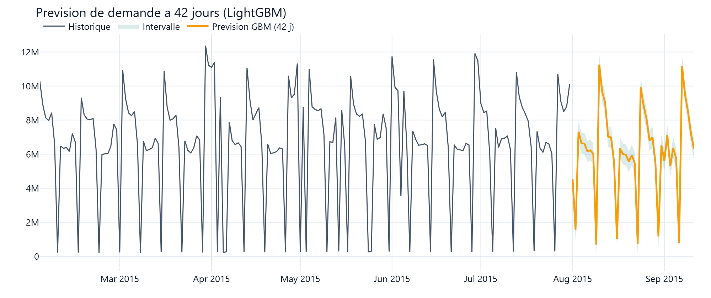
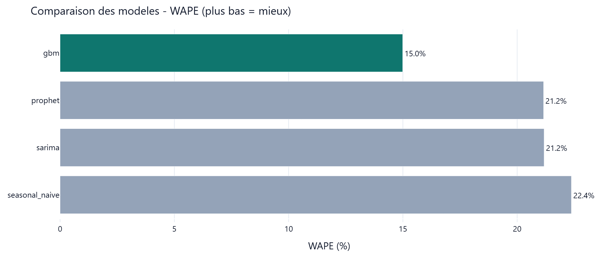
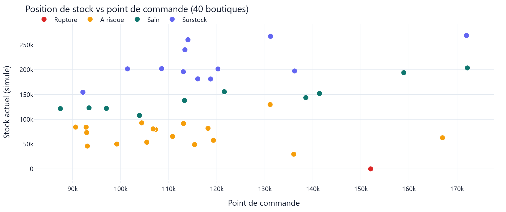
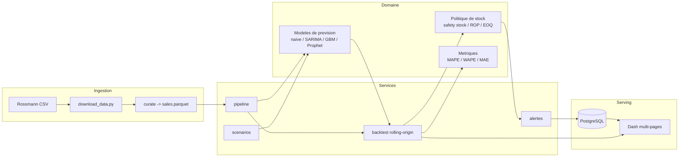
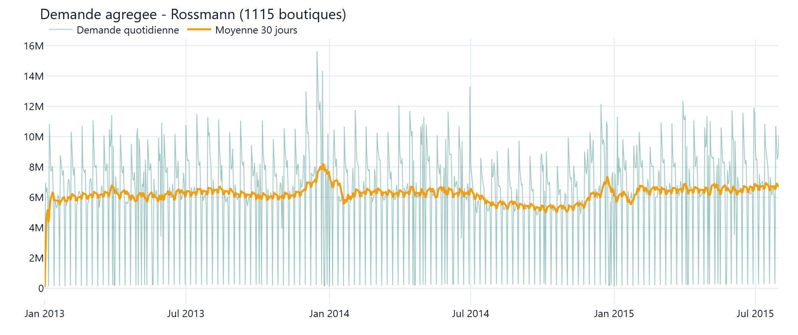

<!-- Banner -->
<p align="center">
  
</p>

<h1 align="center">Supply Chain Control Tower</h1>

<p align="center">
  Prevision de demande, optimisation des stocks et detection des ruptures et
  surstocks sur des donnees de vente reelles (Rossmann Store Sales).
</p>

<p align="center">
  <a href="https://github.com/hardinet/supply-chain-control-tower/actions/workflows/ci.yml">
    </a>
  
  
  
  
  
</p>

<p align="center">
  <a href="#demo">Demo en ligne</a> -
  <a href="#contexte-et-probleme">Etude de cas</a> -
  <a href="#architecture">Architecture</a> -
  <a href="#demarrage-rapide">Demarrage</a> -
  <a href="#resultats">Resultats</a>
</p>

---

> Projet 1 d'un portfolio data/IA. Stack : Python typé, pandas, statsmodels (SARIMA),
> LightGBM, Prophet, Plotly Dash, PostgreSQL, Docker. Palette : Teal `#0F766E` / Ambre `#F59E0B`.

## Demo

Demonstration en ligne : deployable en un clic via le blueprint Render
(`render.yaml`). _Lien a ajouter apres deploiement._

Apercu - figures generees depuis les vraies donnees, reproductibles via
`python -m scripts.make_figures` :

<p align="center">
  
</p>
<p align="center">
  
  
</p>

## Contexte et probleme

Une enseigne de distribution doit decider, chaque semaine et pour chaque magasin,
**combien commander**. Deux erreurs symetriques coutent cher :

- **la rupture** (sous-stock) : ventes perdues, clients decus ;
- **le surstock** : tresorerie immobilisee, demarques, obsolescence.

La bonne decision depend d'une **prevision de demande** fiable et d'une **politique
de reapprovisionnement** explicite. Ce projet construit une *control tower* qui
relie les deux : prevoir, puis traduire la prevision en leviers operationnels
(stock de securite, point de commande) et en alertes.

## Approche

1. **Donnees reelles** : ventes quotidiennes de 1115 magasins Rossmann, enrichies
   des promotions, jours feries et vacances scolaires.
2. **Plusieurs modeles compares** sur un pied d'egalite via un backtesting
   *rolling-origin* : baseline saisonniere, SARIMA, gradient boosting (LightGBM),
   et Prophet (optionnel). Metriques honnetes : MAPE, WAPE, MAE, biais.
3. **Optimisation des stocks** : a partir de la prevision et de sa variabilite,
   calcul du stock de securite (niveau de service cible), du point de commande
   et de la quantite economique (EOQ).
4. **Alertes** : classification de chaque position de stock (rupture, a risque,
   sain, surstock) et tableau de bord multi-pages.

## Architecture



Le code est organise en couches strictes : `domain` (logique pure, sans I/O),
`services` (orchestration), `io` (adaptateurs fichiers / base), `app` (UI Dash).
Voir [docs/adr/](docs/adr/) pour les decisions d'architecture.

## Fonctionnalites

- Prevision multi-modeles avec intervalles de prediction.
- Backtesting *rolling-origin* (fenetre glissante) et classement des modeles.
- Calcul de politique de stock : stock de securite, point de commande, EOQ.
- Detection rupture / surstock avec statut par magasin.
- Simulation de scenarios (« demande +20 % », « lead time +N jours »).
- Application web Dash multi-pages (vue d'ensemble, prevision, stocks, simulation).
- API de sante (`/health`) et logs structures JSON.

## Source des donnees

**Rossmann Store Sales** — ventes quotidiennes historiques de 1115 drogueries
Rossmann en Allemagne, publiees sur Kaggle.
Source : https://www.kaggle.com/competitions/rossmann-store-sales/data

Les donnees ne sont pas versionnees (voir `.gitignore`). Le telechargement est
reproductible via l'API Kaggle (voir ci-dessous).

## Demarrage rapide

### Avec Docker (recommande)

```bash
cp .env.example .env
make up          # construit et lance app + PostgreSQL
# Application : http://localhost:8050
```

### En local (Python 3.11+)

```bash
python -m venv .venv && . .venv/bin/activate     # Windows : .venv\Scripts\activate
make dev-install                                  # installe + hooks pre-commit
make data                                         # telecharge et prepare les donnees
make run                                          # lance l'app Dash
```

> Telechargement des donnees : exporte `KAGGLE_API_TOKEN` (nouveau token `KGAT_...`)
> ou place `~/.kaggle/kaggle.json` (Kaggle > Settings > Create New API Token), puis
> `make data`. Accepte d'abord les regles de la competition sur la page Kaggle.

### Commandes utiles

```bash
make test     # tests + couverture (seuil 80 %)
make lint     # ruff
make type     # mypy strict
make format    # black + ruff --fix
```

## Resultats

Backtesting *rolling-origin* (4 fenetres de 42 jours, strictement hors-echantillon)
sur la demande agregee Rossmann : **1 017 209 lignes, 1115 boutiques, 2013-2015**.
WAPE (volume-pondere) est la metrique phare car la MAPE est artificiellement
gonflee par les dimanches de fermeture (demande proche de zero).

| Modele             | WAPE       | MAPE    | MAE    | Biais % |
|--------------------|------------|---------|--------|---------|
| **gbm (LightGBM)** | **15.0 %** | 88.0 %  | 0.99 M | -4.6 %  |
| prophet            | 21.2 %     | 103.4 % | 1.39 M | -7.9 %  |
| sarima             | 21.2 %     | 119.0 % | 1.40 M | +2.6 %  |
| seasonal_naive     | 22.4 %     | 101.0 % | 1.47 M | +1.0 %  |

Le gradient boosting (features calendaires + lags + moyennes glissantes, prevision
recursive) reduit le **WAPE de 33 %** par rapport a la baseline saisonniere
(15.0 % vs 22.4 %) et devance SARIMA et Prophet. Entierement reproductible :
`make data && python -m sctower.cli backtest`.

<p align="center">
  
</p>

## Structure du projet

```
src/sctower/
  config.py            configuration typee (pydantic-settings)
  logging.py           logs structures (structlog)
  domain/              logique pure : metrics, inventory, forecasting/
  services/            pipeline, backtest, scenarios, alerts
  io/                  loaders fichiers, base (SQLAlchemy)
  app/                 application Dash multi-pages
tests/                 tests unitaires + integration (couverture > 80 %)
scripts/               telechargement des donnees
docs/                  ADR, diagrammes, assets
```

## Qualite et CI

- Typage strict (`mypy --strict`), lint `ruff`, format `black`, hooks `pre-commit`.
- Tests `pytest` avec seuil de couverture a 80 %.
- CI GitHub Actions : lint + type-check + tests + build Docker a chaque push.

## Limites et suites

- Le backtesting porte sur un sous-ensemble de magasins pour rester reproductible
  en CI ; l'echelle complete est documentee dans l'etude de cas.
- Les couts (ordering / holding) de l'EOQ sont parametrables et illustratifs.
- Suites possibles : prevision hierarchique (reconciliation), optimisation
  multi-echelons, integration d'un calendrier promotionnel reel.

## Licence

[MIT](LICENSE) — Ardin Etienne KIMBATSA.
